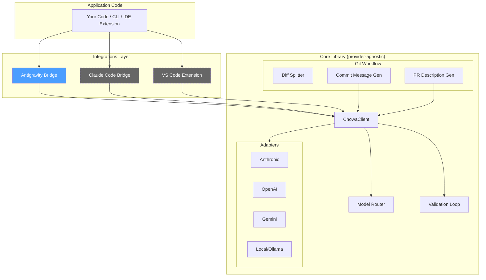

# Chōwa (調和)

> *Harmony across providers* — A coding harness that gives you consistent LLM behavior regardless of which model is doing the work.

Chōwa sits between your application code and LLM providers (Anthropic, OpenAI, Gemini, local models) as a normalization layer for **tool-calling**, **git workflow enforcement**, and **model routing**.

## Why Chōwa?

When using LLMs as coding agents, every provider has different:
- **Tool-call formats** — stringified JSON (OpenAI), already-parsed objects (Anthropic), missing IDs (Gemini)
- **Response shapes** — different nesting, different block types, different quirks
- **Reliability** — some need JSON repair, some need retry loops

Chōwa normalizes all of this so your application code never touches provider-native formats. On top of that, it enforces git workflow conventions (atomic commits, Conventional Commits, PR descriptions) and routes tasks to the right model based on complexity.

## Architecture



> Dashed boxes = planned, not yet implemented.

### Key Constraint

**Dependencies flow one direction: integrations → core, never reverse.** No file under `src/core/`, `src/adapters/`, `src/router/`, or `src/git/` may import from `src/integrations/`. This is enforced by a boundary test and a standalone check script.

## Quick Start

```bash
# Install
bun install

# Run tests
bun test

# Check import boundaries
bun run check:imports

# Use the CLI
bun run src/cli.ts route --kind architecture --complexity high
bun run src/cli.ts commit
bun run src/cli.ts pr --base main
```

## Project Structure

```
src/
├── core/                    # Canonical types, errors, validation
│   ├── types.ts             # CanonicalTool, CanonicalToolCall, CanonicalMessage, etc.
│   ├── errors.ts            # ValidationError, AdapterError, ProviderError
│   ├── validate.ts          # Zod-based tool call validation with retry messages
│   └── index.ts
├── adapters/                # Provider-specific encode/decode
│   ├── anthropic.ts         # ✅ Full implementation (reference adapter)
│   ├── openai.ts            # 📝 Stub with TODOs
│   ├── gemini.ts            # 📝 Stub with TODOs
│   ├── local.ts             # 📝 Stub with TODOs
│   ├── registry.ts          # Adapter lookup + custom registration
│   └── index.ts
├── router/                  # Task → model routing
│   ├── types.ts             # TaskProfile, RoutingRule, RoutingPolicy
│   ├── router.ts            # Pure resolve() function with audit logging
│   └── index.ts
├── git/                     # Git workflow enforcement
│   ├── types.ts             # DiffHunk, DiffCluster, CommitInfo, PRDescription
│   ├── diffSplitter.ts      # Parse diffs, cluster by file (extensible)
│   ├── commitMessage.ts     # Generate Conventional Commits via LLM
│   ├── prDescription.ts     # Generate PR descriptions from commit history
│   ├── gitOps.ts            # Thin simple-git wrapper
│   └── index.ts
├── integrations/            # Integration surfaces (depend on core, never reverse)
│   └── antigravity/
│       ├── skill.md         # Antigravity skill file
│       ├── bridge.ts        # Request/response translation
│       └── index.ts
├── client.ts                # Unified ChowaClient
├── cli.ts                   # CLI entry point
└── index.ts                 # Top-level barrel export

tests/
├── adapters/anthropic.test.ts
├── core/validate.test.ts
├── router/router.test.ts
├── git/
│   ├── diffSplitter.test.ts
│   ├── commitMessage.test.ts
│   └── prDescription.test.ts
├── examples/weather-tool.test.ts
├── boundary.test.ts
└── fixtures/
    ├── anthropic-response.json
    ├── anthropic-response-malformed.json
    ├── sample-diff-mixed.patch
    └── sample-diff-single.patch
```

## Model Routing

Chōwa routes tasks to models based on a configurable policy in `chowa.config.ts`:

| Task Profile | Default Model | Rationale |
|---|---|---|
| `mechanical/*` | Gemini 3 Flash | Fastest, cheapest |
| `security/*` | Claude Opus 4.6 | Strongest reasoning, pinned |
| `architecture/high` | Claude Opus 4.6 | Complex design decisions |
| `refactor/high` | Claude Sonnet 4.6 | Strong reasoning, moderate cost |
| `debug/*` | Claude Sonnet 4.6 | Good balance |
| Default | Claude Sonnet 4.6 | Safe general-purpose |

Routing decisions are logged with the matched rule and can be overridden via CLI flags or config overrides.

## Roadmap

- [x] Core canonical types
- [x] Anthropic adapter (reference implementation)
- [x] Validation loop with retry messages
- [x] Model router with policy config
- [x] Git diff splitter (file-based clustering)
- [x] Commit message generation (Conventional Commits)
- [x] PR description generation
- [x] Antigravity integration stub
- [x] Boundary enforcement (test + script)
- [ ] OpenAI adapter (JSON string parsing, jsonrepair)
- [ ] Gemini adapter (deterministic ID synthesis)
- [ ] Local model adapter (prompt-based structured output)
- [ ] Hunk-level diff clustering
- [ ] Real HTTP transport for providers
- [ ] Claude Code integration
- [ ] VS Code extension integration

## License

MIT
