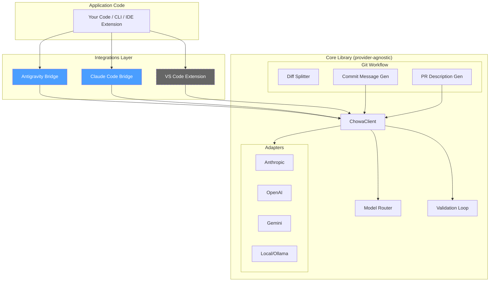

# Chōwa (調和)

> *Harmony across providers* — A coding harness that gives you consistent LLM behavior regardless of which model is doing the work.

Chōwa sits between your application code and LLM providers (Anthropic, OpenAI, Gemini, local models) as a normalization layer for **tool-calling**, **git workflow enforcement**, and **model routing**.

## Why Chōwa?

When using LLMs as coding agents, every provider has different:
- **Tool-call formats** — stringified JSON (OpenAI), already-parsed objects (Anthropic), missing IDs (Gemini)
- **Response shapes** — different nesting, different block types, different quirks
- **Reliability** — some need JSON repair, some need retry loops

Chōwa normalizes all of this so your application code never touches provider-native formats. On top of that, it enforces git workflow conventions (atomic commits, Conventional Commits, PR descriptions) and routes tasks to the right model based on complexity.

## Architecture



> Dashed boxes = planned, not yet implemented.

### Key Constraint

**Dependencies flow one direction: integrations → core, never reverse.** No file under `src/core/`, `src/adapters/`, `src/router/`, or `src/git/` may import from `src/integrations/`. This is enforced by a boundary test and a standalone check script.

## Quick Start

```bash
# Install
bun install

# Run tests
bun test

# Check import boundaries
bun run check:imports

# Type-check everything, including chowa.config.ts
bun run lint

# Use the CLI — routing policy is read from chowa.config.ts (or --config <path>)
bun run src/cli.ts route --kind architecture --complexity high
bun run src/cli.ts commit
bun run src/cli.ts pr --base main
bun run src/cli.ts models --provider anthropic
bun run src/cli.ts route --kind mechanical --complexity low --config ./my-chowa.config.ts

# Structured JSON-in/JSON-out bridges for agent tooling
bun run src/cli.ts claude-code-bridge   # reads a request from stdin
bun run src/cli.ts antigravity-bridge   # reads a request from stdin
```

## Project Structure

```
src/
├── core/                    # Canonical types, errors, validation
│   ├── types.ts             # CanonicalTool, CanonicalToolCall, CanonicalMessage, etc.
│   ├── errors.ts            # ValidationError, AdapterError, ProviderError
│   ├── validate.ts          # Zod-based tool call validation with retry messages
│   └── index.ts
├── adapters/                # Provider-specific encode/decode
│   ├── anthropic.ts         # ✅ Full implementation (reference adapter)
│   ├── gemini.ts            # ✅ Full implementation (deterministic tool-call ID synthesis)
│   ├── openai.ts            # 📝 Stub with TODOs
│   ├── local.ts             # 📝 Stub with TODOs
│   ├── registry.ts          # Adapter lookup + custom registration
│   └── index.ts
├── router/                  # Task → model routing
│   ├── types.ts             # TaskProfile, RoutingRule, RoutingPolicy
│   ├── router.ts            # Pure resolve() function with audit logging + model tier resolution
│   ├── loadPolicy.ts        # Loads RoutingPolicy from chowa.config.ts (or --config), with validation
│   └── index.ts
├── git/                     # Git workflow enforcement
│   ├── types.ts             # DiffHunk, DiffCluster, CommitInfo, PRDescription
│   ├── diffSplitter.ts      # Parse diffs, cluster by file (extensible)
│   ├── commitMessage.ts     # Generate Conventional Commits via LLM
│   ├── prDescription.ts     # Generate PR descriptions from commit history
│   ├── gitOps.ts            # Thin simple-git wrapper
│   └── index.ts
├── integrations/            # Integration surfaces (depend on core, never reverse)
│   ├── antigravity/
│   │   ├── skill.md         # Antigravity skill file
│   │   ├── bridge.ts        # Request/response translation
│   │   └── index.ts
│   └── claude-code/
│       ├── bridge.ts        # Request/response translation (ClaudeCodeBridge)
│       └── index.ts
├── client.ts                # Unified ChowaClient
├── cli.ts                   # CLI entry point
└── index.ts                 # Top-level barrel export

.claude/skills/chowa/SKILL.md   # Claude Code skill — chowa's own dev workflow (also synced to ~/.claude/skills/)
.agents/skills/chowa/SKILL.md   # Same workflow for other agent harnesses (Antigravity, Gemini via sync-global)
specs/<date>-<slug>/            # Persisted spec.md + implementation_plan.md per change, indexed in specs/INDEX.md

tests/
├── adapters/
│   ├── anthropic.test.ts
│   └── gemini.test.ts
├── core/validate.test.ts
├── router/
│   ├── router.test.ts
│   └── loadPolicy.test.ts
├── git/
│   ├── diffSplitter.test.ts
│   ├── commitMessage.test.ts
│   └── prDescription.test.ts
├── integrations/
│   ├── antigravity.test.ts
│   └── claude-code.test.ts
├── examples/weather-tool.test.ts
├── boundary.test.ts
└── fixtures/
    ├── anthropic-response.json
    ├── anthropic-response-malformed.json
    ├── gemini-response.json
    ├── gemini-response-malformed.json
    ├── chowa-config-valid.config.ts
    ├── chowa-config-invalid.config.ts
    ├── sample-diff-mixed.patch
    └── sample-diff-single.patch
```

## Model Routing

Chōwa routes tasks to models based on a configurable policy read from `chowa.config.ts` at the repo root (or a path passed via `--config`):

| Task Profile | Default Model | Rationale |
|---|---|---|
| `mechanical/*` | Gemini 3.6 Flash | Fastest, cheapest |
| `security/*` | Claude Opus 4.6 | Strongest reasoning, pinned |
| `architecture/high` | Claude Opus 4.6 | Complex design decisions |
| `refactor/*` | Gemini 3.6 Flash | Fast workhorse, Sonnet fallback |
| `debug/*` | Gemini 3.6 Flash | Speed & context, Sonnet fallback |
| Default | Gemini 3.6 Flash | Safe general-purpose, Sonnet fallback |

Each target can declare `fallbacks` — if a call to the primary provider/model fails, `ChowaClient.call()` automatically retries against the next fallback target in order, and the result reports whether a fallback was used. Routing decisions are logged with the matched rule (`RoutingDecision.reason`) and can be overridden via CLI flags.

If no `chowa.config.ts` is found at the resolved path, Chōwa falls back to a built-in default policy. An explicitly-passed `--config <path>` that doesn't exist, or a config file with an invalid shape, fails loudly rather than silently falling back — see `src/router/loadPolicy.ts`.

## Roadmap

- [x] Core canonical types
- [x] Anthropic adapter (reference implementation)
- [x] Validation loop with retry messages
- [x] Model router with policy config
- [x] Git diff splitter (file-based clustering)
- [x] Commit message generation (Conventional Commits)
- [x] PR description generation
- [x] Antigravity integration
- [x] Claude Code integration (`ClaudeCodeBridge`, `chowa claude-code-bridge`, Claude Code skill)
- [x] Gemini adapter (deterministic tool-call ID synthesis)
- [x] Config-driven routing (`chowa.config.ts` / `--config` actually loaded, validated, and type-checked)
- [x] Automatic provider/model failover via `RoutingTarget.fallbacks`
- [x] Boundary enforcement (test + script)
- [ ] OpenAI adapter (JSON string parsing, jsonrepair)
- [ ] Local model adapter (prompt-based structured output)
- [ ] Hunk-level diff clustering
- [ ] Real HTTP transport for providers
- [ ] VS Code extension integration

## Development Workflow

Chōwa develops itself (dogfooding) via its own skill conventions:

- **Spec → Plan → Execute.** Non-trivial changes start with a `spec.md`, then an `implementation_plan.md`, each requiring explicit approval before moving on. Both are persisted under `specs/<YYYY-MM-DD>-<slug>/` — never as loose root files — and indexed in [`specs/INDEX.md`](specs/INDEX.md), so intent doesn't drift or get silently overwritten across iterations.
- **Branch flow.** `fix/*`, `feat/*`, `docs/*`, `chore/*` branch from and PR against `develop`. Only `release/*` and `hotfix/*` branch from `develop` (or `main` for a hotfix) and PR to `main`. Never push or PR directly to `main`/`master` otherwise.
- **Conventional Commits**, atomic per logical change, verified with `bun test`, `bun run check:imports`, and `bun run build` before opening a PR.

Full rules live in [`.agents/skills/chowa/SKILL.md`](.agents/skills/chowa/SKILL.md) (general agent harnesses) and [`.claude/skills/chowa/SKILL.md`](.claude/skills/chowa/SKILL.md) (Claude Code — also installed at `~/.claude/skills/chowa/` so it's available in any project, not just this repo).

## License

MIT
