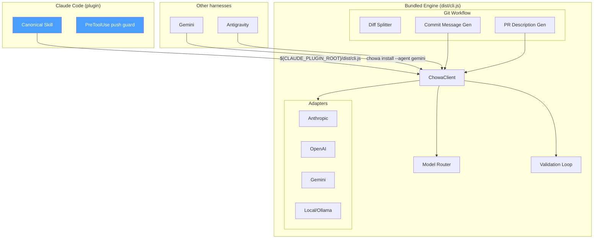

# Chōwa (調和)

> *Harmony across providers* — A coding harness that gives you consistent LLM behavior regardless of which model is doing the work.

Chōwa is a **CLI plus a Claude Code skill**. It enforces a spec → plan → execute pipeline, splits diffs into atomic Conventional Commits, generates PR descriptions, and routes tasks to the right model — normalizing tool-calling across Anthropic, OpenAI, Gemini and local models underneath.

It is not a library you import. There is no npm package; the engine ships inside the plugin. See [Install](#install).

## Why Chōwa?

When using LLMs as coding agents, every provider has different:
- **Tool-call formats** — stringified JSON (OpenAI), already-parsed objects (Anthropic), missing IDs (Gemini)
- **Response shapes** — different nesting, different block types, different quirks
- **Reliability** — some need JSON repair, some need retry loops

Chōwa normalizes all of this behind one CLI, so the workflow you get doesn't change when the model does. On top of that it enforces git workflow conventions (atomic commits, Conventional Commits, PR descriptions) and routes tasks by complexity.

## Architecture



No application ever imports this — the diagram above is entirely inside the CLI process. `openai.ts` and `local.ts` are stubs with TODOs; everything else shown is implemented.

### Key Constraint

**Dependencies flow one direction: integrations → core, never reverse.** No file under `src/core/`, `src/adapters/`, `src/router/`, or `src/git/` may import from `src/integrations/`. This is enforced by a boundary test and a standalone check script.

## Install

### Claude Code

Two commands. No clone, no `npm install`, no copying files around — the engine ships inside the plugin.

```
/plugin marketplace add franprince/chowa
/plugin install chowa@chowa
```

Then opt a project in: add a `chowa.config.ts` (or `.js`/`.mjs`) at its root, add `chowa` as a project dependency, or just ask for it in conversation. The skill also recognizes an existing `specs/INDEX.md` as a sign the project already follows Chōwa's spec convention by hand. Without any of those, the skill stays out of the way and defers to whatever conventions that project already has, offering once to run `chowa init` and scaffold a config for you. Want Chōwa applied to every project you personally work in, no per-project opt-in needed? Run `chowa always-on on` — installing Chōwa means having it available, not applying it everywhere, unless you say otherwise.

**If `marketplace add` fails to clone:** GitHub `owner/repo` shorthand clones over SSH by default. If you authenticate over HTTPS (`gh auth login`), set `CLAUDE_CODE_PLUGIN_PREFER_HTTPS=1`. This is the most common first-run problem.

**Migrating from the manual install:** delete any hand-copied `~/.claude/skills/chowa/SKILL.md`. It will otherwise sit alongside the plugin's copy and the two can disagree.

### Other harnesses (Gemini, Antigravity)

These have no plugin system, so they still need a file drop, and — with npm out of the picture — a checkout of this repo:

```bash
git clone https://github.com/franprince/chowa.git && cd chowa
bun install
bun run src/cli.ts install --agent gemini
```

### Local CLI access via a sibling checkout (optional)

Chōwa isn't published to a registry, so if you want `chowa` runnable through your package manager in another project (`bunx chowa commit`) instead of always invoking a full checkout by path, the option is a local `file:` dependency pointing at a sibling clone of this repo.

It has one sharp edge: `file:` dependencies resolve relative to the *consuming* project's location on disk. That sibling checkout exists only on the machine where you cloned it next to your project — not in CI runners, Docker builds, or any other machine that clones just the consumer repo. A plain `bun install`/`npm install` there fails immediately (`ENOENT: failed opening cache/package/version dir for package chowa`), taking down the whole install, even though nothing in the project actually imports `chowa` at build or run time.

Declare it under `optionalDependencies`, not `dependencies`/`devDependencies`, and have CI skip optional installs:

```json
{
  "optionalDependencies": {
    "chowa": "file:../chowa"
  }
}
```

```bash
bun install --frozen-lockfile --omit=optional
# npm: npm ci --omit=optional
```

This keeps `bunx chowa commit` / `chowa pr` working locally while making CI installs independent of the sibling checkout entirely.

### Runtime

The bundled engine runs on **Node 20+** or Bun. One caveat: reading a `chowa.config.**ts**` at runtime needs TypeScript type stripping, which Node only enables unflagged from 22.18. On older Node, use `chowa.config.js` — it needs no type stripping and works everywhere. Bun reads either natively. Chōwa tells you which applies if it hits the case.

## Working on Chōwa itself

```bash
bun install
bun run verify          # tests + import boundaries + build + type-check

# The CLI, from source
bun run src/cli.ts route --kind architecture --complexity high
bun run src/cli.ts commit
bun run src/cli.ts pr --base main
bun run src/cli.ts models --provider anthropic
bun run src/cli.ts route --kind mechanical --complexity low --config ./my-chowa.config.ts

# Structured JSON-in/JSON-out bridges for agent tooling
bun run src/cli.ts claude-code-bridge   # reads a request from stdin
bun run src/cli.ts antigravity-bridge   # reads a request from stdin

# Plugin maintenance
bun run sync:skill      # regenerate .agents/ skill from the canonical one
bun run build:plugin    # rebuild the bundled engine (release/* branches only)
```

### How the plugin is distributed

This repository *is* the distribution channel — the marketplace catalog lives at `.claude-plugin/marketplace.json` and serves the plugin in `plugins/chowa/`.

- `plugins/chowa/skills/chowa/SKILL.md` is the **canonical** skill. `.agents/skills/chowa/SKILL.md` is generated from it by `bun run sync:skill`; don't edit it by hand. `.claude/skills/chowa/SKILL.md` is project-local to this repo and governs work here only.
- `plugins/chowa/dist/cli.js` is the bundled engine. It exists **only on `main`**, built during the `release/*` process, so `develop` and feature branches never carry a generated file and never conflict on one. CI enforces both halves: it fails a PR into `main` whose bundle is stale, and fails a PR anywhere else that commits one.

## Project Structure

```
src/
├── core/                    # Canonical types, errors, validation
│   ├── types.ts             # CanonicalTool, CanonicalToolCall, CanonicalMessage, etc.
│   ├── errors.ts            # ValidationError, AdapterError, ProviderError
│   ├── validate.ts          # Zod-based tool call validation with retry messages
│   └── index.ts
├── adapters/                # Provider-specific encode/decode
│   ├── anthropic.ts         # ✅ Full implementation (reference adapter)
│   ├── gemini.ts            # ✅ Full implementation (deterministic tool-call ID synthesis)
│   ├── openai.ts            # 📝 Stub with TODOs
│   ├── local.ts             # 📝 Stub with TODOs
│   ├── registry.ts          # Adapter lookup + custom registration
│   └── index.ts
├── router/                  # Task → model routing
│   ├── types.ts             # TaskProfile, RoutingRule, RoutingPolicy
│   ├── router.ts            # Pure resolve() function with audit logging + model tier resolution
│   ├── loadPolicy.ts        # Loads RoutingPolicy from chowa.config.{ts,js,mjs} (or --config), with validation
│   └── index.ts
├── git/                     # Git workflow enforcement
│   ├── types.ts             # DiffHunk, DiffCluster, CommitInfo, PRDescription
│   ├── diffSplitter.ts      # Parse diffs, cluster by file (extensible)
│   ├── commitMessage.ts     # Generate Conventional Commits via LLM
│   ├── prDescription.ts     # Generate PR descriptions from commit history
│   ├── gitOps.ts            # Thin simple-git wrapper
│   └── index.ts
├── integrations/            # Integration surfaces (depend on core, never reverse)
│   ├── antigravity/
│   │   ├── skill.md         # Antigravity skill file
│   │   ├── bridge.ts        # Request/response translation
│   │   └── index.ts
│   ├── claude-code/
│   │   ├── bridge.ts        # Request/response translation (ClaudeCodeBridge)
│   │   └── index.ts
│   └── install.ts           # `chowa install --agent <harness>` (Gemini, Antigravity)
├── client.ts                # Unified ChowaClient
├── cli.ts                   # CLI entry point
└── index.ts                 # Top-level barrel export

.claude-plugin/marketplace.json     # Marketplace catalog — this repo IS the distribution channel
plugins/chowa/
├── .claude-plugin/plugin.json      # Plugin manifest
├── skills/chowa/SKILL.md           # THE canonical skill — .agents/ is generated from this
├── hooks/hooks.json + scripts/     # PreToolUse push-protection hook
└── dist/cli.js                    # Bundled engine — main only, built during release/*, gitignored elsewhere

.claude/skills/chowa/SKILL.md   # Project-local: governs work in Chōwa's own repo only, not distributed
.agents/skills/chowa/SKILL.md   # Generated from plugins/chowa/skills/chowa/SKILL.md via `bun run sync:skill`
specs/<date>-<slug>/            # Persisted spec.md + implementation_plan.md per change, indexed in specs/INDEX.md

tests/
├── adapters/
│   ├── anthropic.test.ts
│   └── gemini.test.ts
├── core/validate.test.ts
├── router/
│   ├── router.test.ts
│   └── loadPolicy.test.ts
├── git/
│   ├── diffSplitter.test.ts
│   ├── commitMessage.test.ts
│   └── prDescription.test.ts
├── integrations/
│   ├── antigravity.test.ts
│   ├── claude-code.test.ts
│   └── install.test.ts
├── hooks/guardPush.test.ts
├── scripts/syncSkill.test.ts
├── examples/weather-tool.test.ts
├── boundary.test.ts
└── fixtures/
    ├── anthropic-response.json
    ├── anthropic-response-malformed.json
    ├── gemini-response.json
    ├── gemini-response-malformed.json
    ├── chowa-config-valid.config.ts
    ├── chowa-config-valid.config.js
    ├── chowa-config-invalid.config.ts
    ├── sample-diff-mixed.patch
    └── sample-diff-single.patch
```

## Model Routing

Chōwa routes tasks to models based on a configurable policy read from `chowa.config.ts`, `.js`, or `.mjs` at the project root — probed in that order — or a path passed via `--config`:

| Task Profile | Default Model | Rationale |
|---|---|---|
| `mechanical/*` | Gemini 3.6 Flash | Fastest, cheapest |
| `security/*` | Claude Opus 4.6 | Strongest reasoning, pinned |
| `architecture/high` | Claude Opus 4.6 | Complex design decisions |
| `refactor/*` | Gemini 3.6 Flash | Fast workhorse, Sonnet fallback |
| `debug/*` | Gemini 3.6 Flash | Speed & context, Sonnet fallback |
| Default | Gemini 3.6 Flash | Safe general-purpose, Sonnet fallback |

Each target can declare `fallbacks` — if a call to the primary provider/model fails, `ChowaClient.call()` automatically retries against the next fallback target in order, and the result reports whether a fallback was used. Routing decisions are logged with the matched rule (`RoutingDecision.reason`) and can be overridden via CLI flags.

If none of the three candidates exist, Chōwa falls back to a built-in default policy. An explicitly-passed `--config <path>` that doesn't exist, or a config file with an invalid shape, fails loudly rather than silently falling back — see `src/router/loadPolicy.ts`. A `chowa.config.ts` needs Node ≥ 22.18 (or Bun) to load at runtime; `.js`/`.mjs` work everywhere, and Chōwa says so if it hits the case.

## Roadmap

- [x] Core canonical types
- [x] Anthropic adapter (reference implementation)
- [x] Validation loop with retry messages
- [x] Model router with policy config
- [x] Git diff splitter (file-based clustering)
- [x] Commit message generation (Conventional Commits)
- [x] PR description generation
- [x] Antigravity integration
- [x] Claude Code integration (`ClaudeCodeBridge`, `chowa claude-code-bridge`, Claude Code skill)
- [x] Gemini adapter (deterministic tool-call ID synthesis)
- [x] Config-driven routing (`chowa.config.{ts,js,mjs}` / `--config` loaded, validated, type-checked, and readable on any supported runtime)
- [x] Automatic provider/model failover via `RoutingTarget.fallbacks`
- [x] Boundary enforcement (test + script)
- [x] Claude Code plugin, distributed from a marketplace in this repo — no npm, no manual file copying
- [x] Push-protection hook (`PreToolUse`) enforcing the no-push-to-`main` rule mechanically, not just in prose
- [x] `chowa install --agent <harness>` for harnesses without a plugin system (Gemini today)
- [x] CI: quality gates on every PR, plus bundle-freshness enforcement on `main`
- [ ] OpenAI adapter (JSON string parsing, jsonrepair)
- [ ] Local model adapter (prompt-based structured output)
- [ ] Hunk-level diff clustering
- [ ] Real HTTP transport for providers
- [ ] `check-update` as a hook, not just a suggested command
- [ ] Antigravity as an `install --agent` target (currently file-drop only)

## Development Workflow

Chōwa develops itself (dogfooding) via its own skill conventions:

- **Spec → Plan → Execute.** Non-trivial changes start with a `spec.md`, then an `implementation_plan.md`, each requiring explicit approval before moving on. Both are persisted under `specs/<YYYY-MM-DD>-<slug>/` — never as loose root files — and indexed in [`specs/INDEX.md`](specs/INDEX.md), so intent doesn't drift or get silently overwritten across iterations.
- **Branch flow.** `fix/*`, `feat/*`, `docs/*`, `chore/*` branch from and PR against `develop`. Only `release/*` and `hotfix/*` branch from `develop` (or `main` for a hotfix) and PR to `main`. Never push or PR directly to `main`/`master` otherwise.
- **Conventional Commits**, atomic per logical change, verified with `bun test`, `bun run check:imports`, and `bun run build` before opening a PR.

Full rules live in [`.agents/skills/chowa/SKILL.md`](.agents/skills/chowa/SKILL.md) (general agent harnesses) and [`.claude/skills/chowa/SKILL.md`](.claude/skills/chowa/SKILL.md) (Claude Code — also installed at `~/.claude/skills/chowa/` so it's available in any project, not just this repo).

## License

MIT
