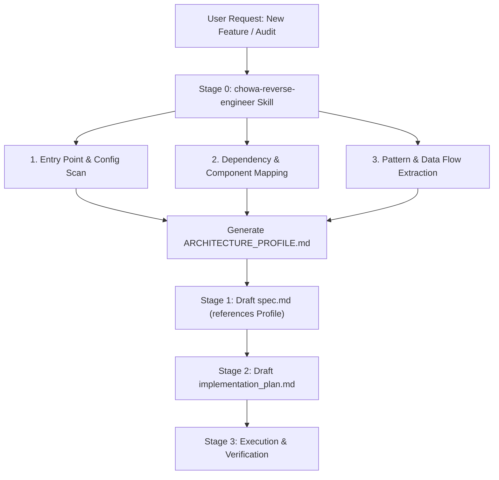

# Spec: Reverse Engineering & Architecture Investigation Skill (`chowa-reverse-engineer`)

**Status:** Draft  
**Date:** 2026-08-06  
**Author:** Antigravity / Fran  

---

## 1. Problem Statement

When initiating feature development or refactoring in an existing codebase, AI coding assistants often lack a deep, systematic understanding of the system's underlying architecture, boundaries, conventions, data flows, and hidden constraints. Relying on superficial snippet viewing can lead to:
1. Hallucinated or misaligned component patterns (e.g., introducing new patterns that conflict with established repo conventions).
2. Breaking implicit contracts between layers (e.g., adapter vs. core vs. router boundaries).
3. Drafted `spec.md` and `implementation_plan.md` files that ignore existing architectural debt or fragile integrations.

Currently, Chōwa provides a robust 3-stage feature development pipeline (Spec → Plan → Execute), but lacks a dedicated, standardized pre-planning investigation skill to reverse-engineer project architecture and produce structured feedback specifically consumable by Chōwa's Stage 1 (`spec.md`) and Stage 2 (`implementation_plan.md`).

---

## 2. Goals & Non-Goals

### Goals
- **Systematic Codebase Audit**: Define a specialized skill (`chowa-reverse-engineer`) that performs structured reverse engineering of unfamiliar or complex codebases.
- **Architectural Extraction**: Automatically discover component hierarchies, module boundaries, entry points, configuration schemas, dependency graphs, state flows, and error handling patterns.
- **Planner-Compatible Feedback Output**: Produce a standardized `ARCHITECTURE_PROFILE.md` (or inline context summary) formatted explicitly for Chōwa's main spec generator and implementation planner.
- **Spec & Plan Integration**: Enhance Stage 1 (`spec.md`) and Stage 2 (`implementation_plan.md`) workflows so that feature specifications reference and respect the reverse-engineered architectural profile.
- **Harness Portability**: Ship the skill across all supported Chōwa targets (Claude Code plugin bundle, self-hosted `.claude/skills/`, and portable `.agents/skills/`).

### Non-Goals
- Replacing runtime debugging tools or memory profilers.
- Refactoring or writing feature code directly inside the reverse engineering skill (the skill is strictly read-only and analytical).
- Generating full UML/documentation sites for external publishing (focus is actionable developer/AI context for planning).

---

## 3. Workflow & Architecture Integration



### Skill Execution Stages
1. **Discovery & Stack Assessment**:
   - Inspect package managers (`package.json`, `bun.lock`, `cargo.toml`, `go.mod`, `pyproject.toml`).
   - Identify build scripts, linters, test runner setups, and type checking rules.
2. **Structural Breakdown & Component Map**:
   - Map directory layout and identify layer boundaries (e.g., Core vs UI vs API vs Database).
   - Identify core domain entities, types, and schemas.
3. **Data Flow & Pattern Extraction**:
   - Trace primary control flows from entry points to side effects.
   - Detect established design patterns (e.g., Factory, Adapter, Strategy, Event-driven).
   - Identify risk zones, technical debt, and strict execution constraints.
4. **Planner Feedback Generation**:
   - Write or update `specs/ARCHITECTURE_PROFILE.md`.
   - Provide explicit "Guidelines for Feature Planning" formatted as structured markdown blocks consumable during Stage 1 (`spec.md`) and Stage 2 (`implementation_plan.md`).

---

## 4. Input & Output Schemas

### Input Parameters
When invoked manually or via subagent, `chowa-reverse-engineer` accepts:
- `target_path` *(optional)*: Subdirectory or root path to analyze (defaults to project root).
- `focus_area` *(optional)*: Specific module, subsystem, or feature area of interest (e.g., `routing`, `auth`, `state-management`).
- `depth` *(optional)*: Level of analysis (`quick_overview`, `standard`, `deep_audit`). Default is `standard`.

### Output Artifact (`specs/ARCHITECTURE_PROFILE.md`)
```markdown
# Project Architecture Profile

## 1. Executive Summary & Tech Stack
- **Primary Languages & Runtimes**: Node.js / Bun / TypeScript
- **Frameworks & Libraries**: ...
- **Build & Quality Gates**: ...

## 2. Directory Layout & Layer Boundaries
- `src/core/`: ...
- `src/adapters/`: ...
- `src/cli/`: ...

## 3. Core Entities & Type Systems
- Key interfaces, structs, and schemas.

## 4. Key Architectural Patterns & Data Flows
- Control flow diagram / description.
- Established design patterns in use.

## 5. System Constraints & Technical Debt
- Critical invariants that must not be broken.
- Known fragile areas or anti-patterns to avoid.

## 6. Recommendations for Chōwa Feature Planning
- **Module extension points**: Where to add new features.
- **Testing strategy alignment**: How to structure new tests.
- **Convention checklist**: Naming, error handling, and type safety constraints.
```

---

## 5. Acceptance Criteria

1. **Skill Definition**:
   - A dedicated `chowa-reverse-engineer` skill template exists in `franprince/chowa-skill` (and is generated for canonical, self-hosted, and portable targets).
2. **Analysis Methodology**:
   - Clear guidelines instructing agents to systematically inspect config files, entry points, module exports, and test suites without making arbitrary assumptions.
3. **Structured Output**:
   - Produces a standardized `specs/ARCHITECTURE_PROFILE.md` file adhering to the defined schema.
4. **Integration with Chōwa Pipeline**:
   - Main `chowa` skill updated to recommend executing `chowa-reverse-engineer` when starting work on complex/unfamiliar projects prior to Stage 1 `spec.md`.
5. **Verification**:
   - Unit and template sync tests pass via `bun run verify`.
